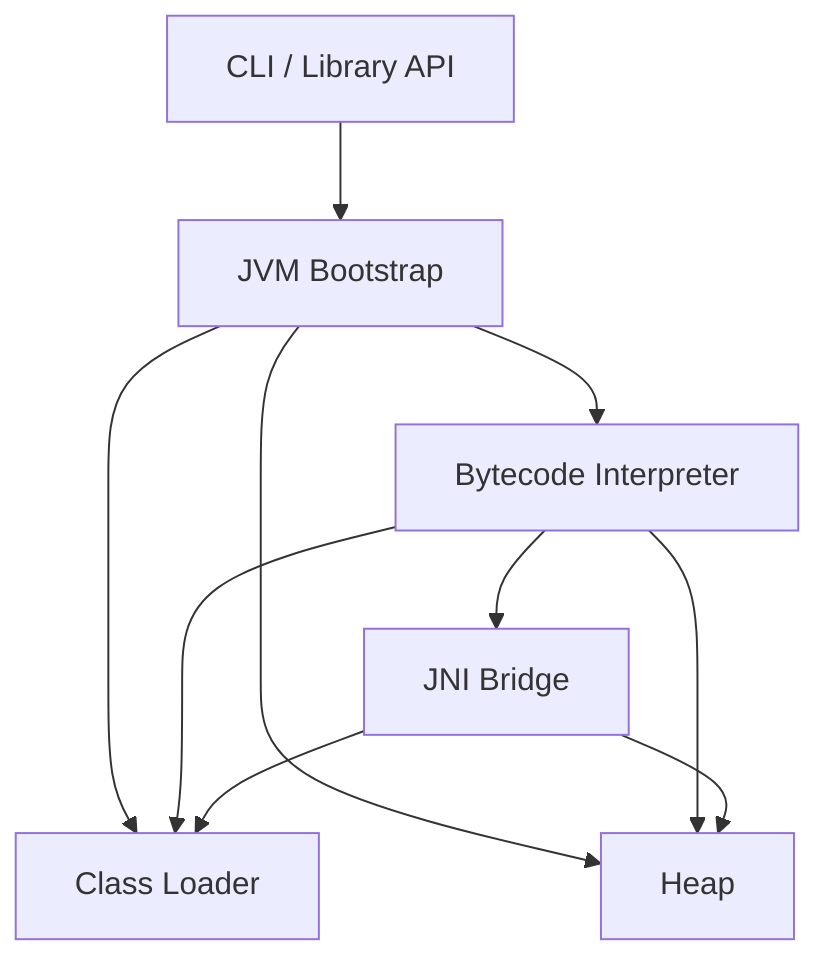
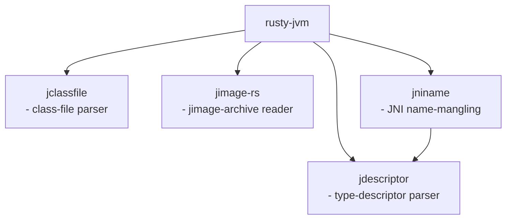

# rusty-jvm
![Platform][platforms-image]
[![Crate][crate-image]][crate-link]
[![Docs][docs-image]][docs-link]
[![Build Status][ci-image]][ci-link]
![License][license-image]
[![codecov][code-cov-image]][code-cov-link]
[![dependency status][dep-status-image]][dep-status-link]

## Introduction

This project is a Java Virtual Machine (JVM) implemented in Rust, built to run Java programs independently of existing JVMs.
Everything related to Java is implemented from scratch.
The current version executes Java bytecode in interpreted mode, with the introduction of a Just-In-Time (JIT) compiler identified as a future milestone.
The next major objectives include the integration of garbage collection and support for multithreading.

## Implemented Key Features

- 100% of actual opcodes ([JVMS §6][jvms-6])
- Lambda Expressions ([JLS §15.27][jls-15.27])
- Static initialization ([JVMS §5.5][jvms-5.5], [implementation details](docs/class_static_initialization.md))
- Polymorphic models ([JLS §8.4.8][jls-8.4.8])
- Single- and multi-dimensional arrays ([JLS §10][jls-10])
- Exceptions ([JLS §11][jls-11])
- Record Classes ([JVMS §8.10][jls-8.10])
- Type casting ([JLS §5.5][jls-5.5])
- Program arguments ([JLS §12.1.4][jls-12.1.4])
- Assertions ([JLS §14.10][jls-14.10])
- [Dynamic Language Support][java.lang.invoke-api] (partially)
- [Stream API][java.util.stream-api] (partially)
- [Reflection][java.lang.reflect-api] (some features)
- [java.io][java.io-api] (partially)
- [java.nio][java.nio-api] (partially)
- [java.util.zip][java.util.zip-api] (partially)
- [java.lang.System][java.lang.system-api] (most features)
- [JAR-files][jar] loading and execution
- [Shared libraries loading and execution][jni-lib-load] (partially)
- [Java Native Interface Functions][jni-funcs] (partially)

See [integration tests](tests/test_data) for broader examples of supported Java features.

## Architecture

rusty-jvm is structured around six high-level concerns:



See [architecture.md](docs/architecture.md) for detailed diagrams covering the
class-loading pipeline, heap memory model, execution loop, vtable dispatch, and JNI bridge.

## Design Decisions
See [design-decisions.md](docs/design-decisions.md) for a detailed description of the design decisions made in this project.

## Sub-crates

The project is organised as a Cargo workspace.
Components with well-defined, reusable APIs are published as independent crates:

| Crate | Description |
|---|---|
| [`jclassfile`](jclassfile/) | `.class` file parser |
| [`jdescriptor`](jdescriptor/) | JVM type-descriptor and method-signature parser |
| [`jimage-rs`](jimage-rs/) | Reader for JDK `.jimage` archive files |
| [`jniname`](jniname/) | JNI name-mangling utilities |



## Roadmap

The following milestones are planned in order:

1. **Garbage Collection** — a tracing GC to reclaim unreachable heap objects.
2. **Multithreading** — `java.lang.Thread`, `synchronized`, and the Java Memory Model.
3. **JIT Compilation** — profile-guided native code generation for hot methods.

## Java Standard Library Classes

This project relies on standard library classes from the **JDK 25 (LTS)**.
To run the Java code, you must have **JDK 25 (LTS)** installed on your machine and ensure the `JAVA_HOME` environment variable is properly set.

## Getting Started

### Prerequisites

Ensure the following are set up:

- A machine running **Windows**, **MacOS**, or **Linux**
- **Rust** installed
- **JDK 25 (LTS)** installed with the `JAVA_HOME` environment variable set

### Example Program: Count Fruits
Create a file named `FruitCount.java` with the following content:
```java
import java.util.List;
import java.util.Map;
import java.util.function.Function;
import java.util.stream.Collectors;

public class FruitCount {
    public static void main(String[] args) {
        List<String> fruits = List.of("apple", "banana", "apple", "orange", "banana", "apple");

        Map<String, Long> counts = fruits.stream()
                .collect(Collectors.groupingBy(Function.identity(), Collectors.counting()));

        System.out.println(counts);
    }
}
```

#### Steps to Run

1. Compile the program using the Java compiler:
   ```sh
   javac FruitCount.java
   ```

2. Run it using rusty-jvm:
   ```sh
   cargo run -- FruitCount
   ```

3. Run tests:
    ```sh
    cargo test --test integration_tests
    ```

## License
`rusty-jvm` is licensed under the [MIT License](LICENSE).

## Contributing

Contributions are welcome!
See [CONTRIBUTING.md](CONTRIBUTING.md) for how to build the project, add integration tests,
and implement new native methods.

[//]: # (links)
[platforms-image]: https://img.shields.io/badge/platforms-Linux%20%7C%20MacOS%20%7C%20Windows-blue
[crate-image]: https://img.shields.io/crates/v/rusty-jvm.svg
[crate-link]: https://crates.io/crates/rusty-jvm
[docs-image]: https://docs.rs/rusty-jvm/badge.svg
[docs-link]: https://docs.rs/rusty-jvm
[ci-image]: https://github.com/hextriclosan/rusty-jvm/actions/workflows/rust.yml/badge.svg
[ci-link]: https://github.com/hextriclosan/rusty-jvm/actions
[license-image]: https://img.shields.io/github/license/hextriclosan/rusty-jvm
[code-cov-image]: https://codecov.io/gh/hextriclosan/rusty-jvm/branch/main/graph/badge.svg
[code-cov-link]: https://codecov.io/gh/hextriclosan/rusty-jvm
[dep-status-image]: https://deps.rs/repo/github/hextriclosan/rusty-jvm/status.svg
[dep-status-link]: https://deps.rs/repo/github/hextriclosan/rusty-jvm

[jvms-5.5]: https://docs.oracle.com/javase/specs/jvms/se25/html/jvms-5.html#jvms-5.5
[jvms-6]: https://docs.oracle.com/javase/specs/jvms/se25/html/jvms-6.html
[jls-5.5]: https://docs.oracle.com/javase/specs/jls/se25/html/jls-5.html#jls-5.5
[jls-8.4.8]: https://docs.oracle.com/javase/specs/jls/se25/html/jls-8.html#jls-8.4.8
[jls-8.10]: https://docs.oracle.com/javase/specs/jls/se25/html/jls-8.html#jls-8.10
[jls-10]: https://docs.oracle.com/javase/specs/jls/se25/html/jls-10.html
[jls-11]: https://docs.oracle.com/javase/specs/jls/se25/html/jls-11.html
[jls-12.1.4]: https://docs.oracle.com/javase/specs/jls/se25/html/jls-12.html#jls-12.1.4
[jls-14.10]: https://docs.oracle.com/javase/specs/jls/se25/html/jls-14.html#jls-14.10
[jls-15.27]: https://docs.oracle.com/javase/specs/jls/se25/html/jls-15.html#jls-15.27
[java.util.stream-api]: https://docs.oracle.com/en/java/javase/25/docs/api/java.base/java/util/stream/package-summary.html
[java.io-api]: https://docs.oracle.com/en/java/javase/25/docs/api/java.base/java/io/package-summary.html
[java.nio-api]: https://docs.oracle.com/en/java/javase/25/docs/api/java.base/java/nio/package-summary.html
[java.lang.invoke-api]: https://docs.oracle.com/en/java/javase/25/docs/api/java.base/java/lang/invoke/package-summary.html
[java.lang.reflect-api]: https://docs.oracle.com/en/java/javase/25/docs/api/java.base/java/lang/reflect/package-summary.html
[java.util.zip-api]: https://docs.oracle.com/en/java/javase/25/docs/api/java.base/java/util/zip/package-summary.html
[java.lang.system-api]: https://docs.oracle.com/en/java/javase/25/docs/api/java.base/java/lang/System.html
[jar]: https://docs.oracle.com/en/java/javase/25/docs/specs/jar/jar.html
[jni-lib-load]: https://docs.oracle.com/en/java/javase/25/docs/specs/jni/design.html#compiling-loading-and-linking-native-methods
[jni-funcs]: https://docs.oracle.com/en/java/javase/25/docs/specs/jni/functions.html
