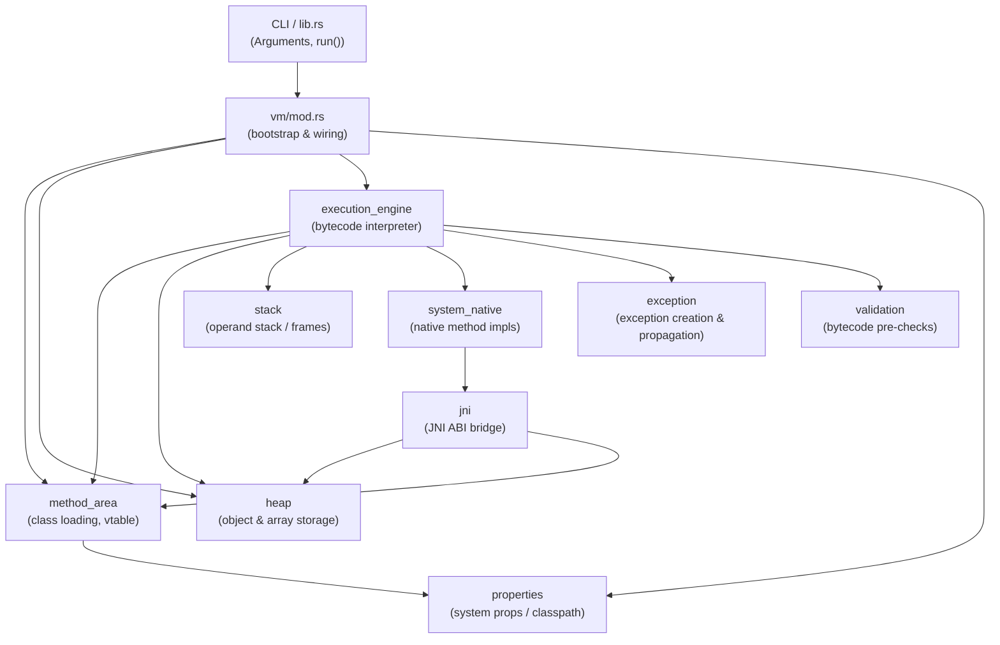
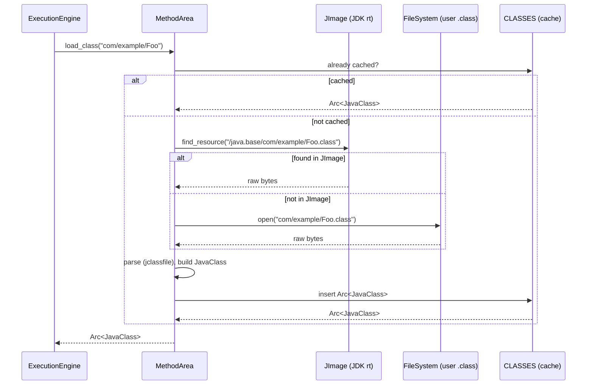
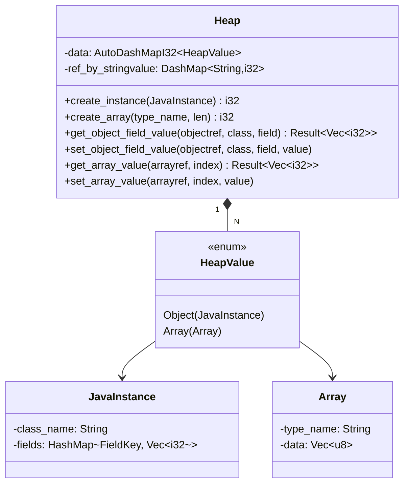
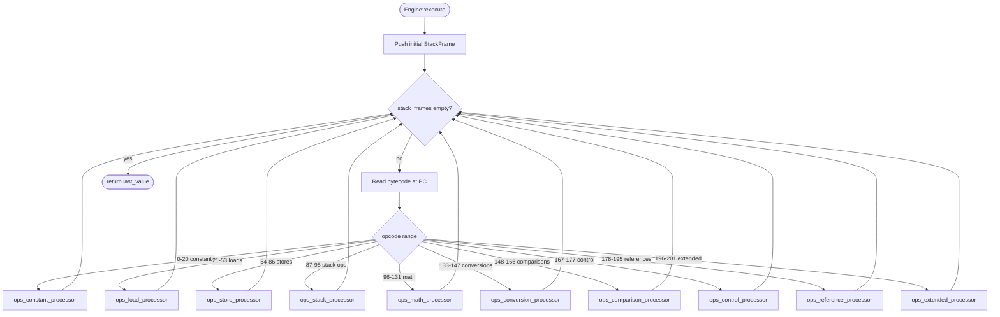
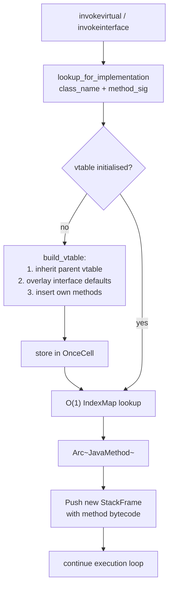
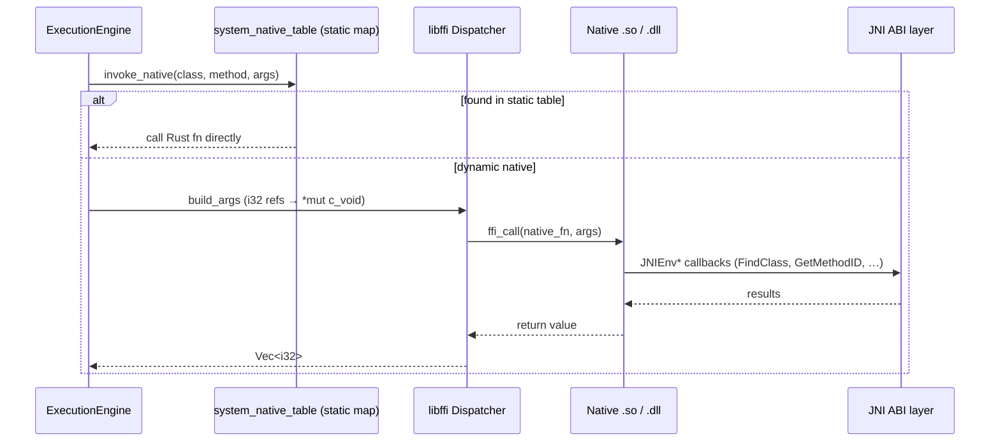

# Architecture of rusty-jvm

This document describes the internal architecture of `rusty-jvm` - a Java Virtual Machine
implemented from scratch in Rust, targeting the JVM Specification SE 25.

---

## 1. Top-Level Module Map

The VM is split into a set of tightly-scoped modules.
Each module owns exactly one piece of VM state and exposes a narrow, well-typed interface to the rest of the system.

---

## 2. Class-Loading Pipeline

Classes are loaded on first reference (lazy loading) and cached forever in `CLASSES` - a global
`DashMap` keyed by the JVM internal class name (e.g. `java/lang/String`).

---

## 3. Heap Memory Model

The heap is a `DashMap<i32, HeapValue>`.
Every object reference in the VM is a plain `i32` (matching the JVM operand-stack word size).
References start at 1; 0 is the JVM null.

---

## 4. Bytecode Execution Loop

The interpreter is a single `while` loop over a `StackFrames` stack.
Each iteration reads one bytecode, delegates to an opcode-family processor, then loops.
Method calls push a new frame; returns pop it.

---

## 5. Virtual Method Dispatch (vtable)

Each `JavaClass` holds a lazily-initialized vtable: an `OnceCell<IndexMap<String, Arc<JavaMethod>>>`.
The vtable is built once by `MethodArea::build_vtable`, which follows the order mandated by JVMS §5.4.5:
parent vtable → interface default methods → own concrete methods.

---

## 6. JNI Bridge

Native methods declared in Java class files are dispatched through a two-layer bridge:
a static lookup table that maps JVM internal method names to Rust function pointers,
and a `libffi`-based dynamic dispatcher for methods loaded from external `.so`/`.dll` libraries.

