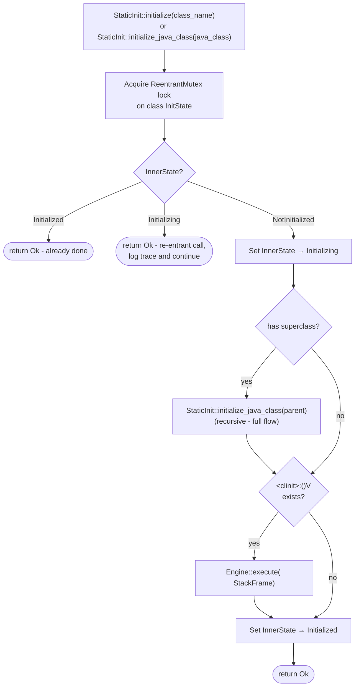

# Class Static Initialization

This document describes how `rusty-jvm` implements the class static initialization process ([JVMS §5.5][jvms-5.5]).

---

## Overview

Static initialization runs the `<clinit>` method of a class exactly once, before
the class is first actively used.  The implementation lives in
`src/vm/execution_engine/static_init.rs` (`StaticInit`) and uses a per-class
`ReentrantMutex<InitState>` to guarantee at-most-once execution even under
recursive or re-entrant calls.

---

## Initialization State Machine

Each `JavaClass` tracks its initialization state through three values defined in
`InnerState`:

```
NotInitialized  ──►  Initializing  ──►  Initialized
```

The state is stored inside a `ReentrantMutex<InitState>` so that re-entrant
calls on the same thread (which can happen when a `<clinit>` body itself
triggers another use of the same class) are detected and allowed to proceed
without deadlock.

---

## Initialization Flow



---

## Key Design Points

* **At-most-once execution** - the `Initialized` guard in the state machine
  ensures the `<clinit>` body runs exactly once per class, no matter how many
  threads or opcodes request initialization concurrently.

* **Re-entrancy safety** - `ReentrantMutex` allows the same OS thread to
  re-acquire the lock.  If `<clinit>` of class `A` references class `A` again
  (directly or transitively), the inner call sees `Initializing` and returns
  immediately, matching the permissive re-entrancy rule in [JVMS §5.5][jvms-5.5] step 3.

* **Parent-first ordering** - the superclass chain is initialized depth-first
  before the subclass's own `<clinit>` runs, honoring [JVMS §5.5][jvms-5.5] step 7.

* **No `<clinit>` → no overhead** - if a class has no static initializer the
  state is still advanced to `Initialized` so further checks are O(1) mutex
  acquires followed by an immediate return.

[jvms-5.5]: https://docs.oracle.com/javase/specs/jvms/se25/html/jvms-5.html#jvms-5.5
